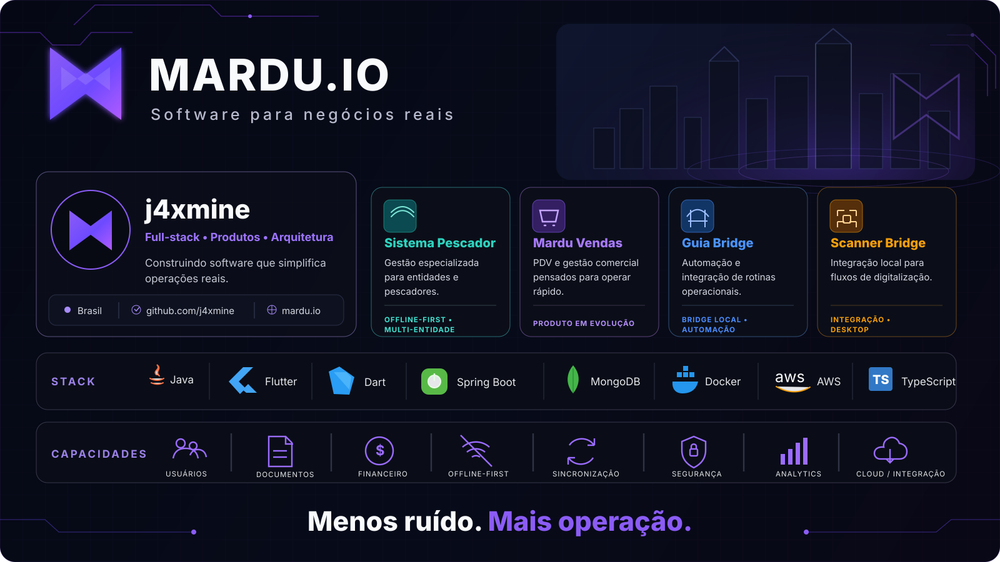

  

  <a href="https://mardu.io"><strong>mardu.io</strong></a>
  &nbsp;•&nbsp;
  <a href="https://github.com/j4xmine">github.com/j4xmine</a>

## Sobre a Mardu.io

Estou construindo a **Mardu.io**, um software studio focado em transformar rotinas operacionais reais em produtos simples, confiáveis e preparados para crescer.

A ideia central é direta: **menos ruído, mais operação**. O software nasce do fluxo de trabalho real, com interfaces objetivas, automação onde gera valor, segurança desde a base e evolução controlada da arquitetura.

## Produtos

### Sistema Pescador

Plataforma de gestão especializada para entidades e equipes que atendem pescadores profissionais.

- cadastro e histórico do pescador;
- gestão documental;
- produção pesqueira, GPS e seguro-defeso;
- financeiro com cobranças e recebimentos;
- usuários, RBAC e isolamento por entidade;
- operação **offline-first**;
- sincronização entre aplicação local e backend;
- rastreabilidade e consistência de dados.

`Flutter` `Dart` `Java` `Spring Boot` `MongoDB` `SQLite` `Docker` `AWS`

### Mardu Vendas

Produto de PDV e gestão comercial em evolução dentro do ecossistema Mardu, pensado para simplificar venda, estoque, clientes, caixa e visão gerencial.

**Objetivo:** menos etapas para vender e mais clareza para administrar.

---

## Engenharia

| Princípio | Aplicação |
|---|---|
| **Minimalista por escolha** | Interfaces limpas, hierarquia clara e menos distrações. |
| **Feito para a operação** | O produto nasce do fluxo real de trabalho. |
| **Segurança desde a base** | Autorização, isolamento, rastreabilidade e superfície de ataque reduzida. |
| **Offline-first quando faz sentido** | A operação continua mesmo quando a conexão não é perfeita. |
| **Preparado para crescer** | Arquitetura modular e evolução controlada. |

## Stack principal

| Área | Tecnologias |
|---|---|
| Aplicações | Flutter, Dart, Kotlin |
| Backend | Java, Spring Boot |
| Web | Astro, TypeScript |
| Dados | MongoDB, SQLite |
| Infraestrutura | Docker, AWS |
| Entrega | Git, GitHub Actions, CI/CD |
| Arquitetura | Offline-first, multi-entidade, RBAC, APIs REST |

## Em construção

- evolução contínua do **Sistema Pescador**;
- módulos financeiros e operacionais;
- experiência offline-first e sincronização;
- automações para rotinas administrativas;
- infraestrutura de distribuição, atualização e serviços;
- consolidação do ecossistema **Mardu.io**;
- evolução do **Mardu Vendas**.

  <strong>Mardu.io</strong> 
  Software para negócios reais. 
  Menos ruído. Mais operação.

