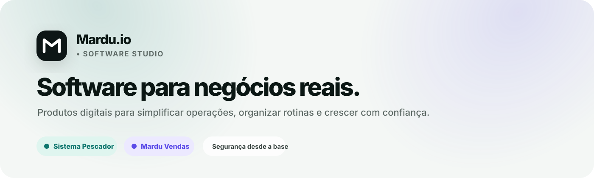

<p align="center">
  
</p>

<h1 align="center">Mardu.io</h1>

<p align="center">
  <strong>Software para negócios reais.</strong><br/>
  Produtos digitais construídos para reduzir complexidade, organizar operações e crescer com segurança.
</p>

<p align="center">
  Flutter · Dart · Java · Spring Boot · Kotlin · TypeScript · MongoDB · SQLite · Docker · AWS
</p>

---

## Sobre

Estou construindo a **Mardu.io**, um software studio focado em transformar rotinas operacionais reais em produtos simples, confiáveis e preparados para crescer.

O trabalho parte de uma ideia central: **menos ruído, mais operação**. Isso significa interfaces objetivas, automação onde realmente gera valor, arquitetura segura e evolução controlada do produto.

Atualmente, o ecossistema Mardu concentra dois produtos.

## Sistema Pescador

Plataforma de gestão especializada para entidades e equipes que atendem pescadores profissionais.

**Principais frentes do produto:**

- cadastro e histórico do pescador;
- organização e gestão documental;
- produção pesqueira, GPS e seguro-defeso;
- financeiro com cobranças e recebimentos;
- usuários, perfis de acesso e isolamento por entidade;
- operação **offline-first** para manter o trabalho mesmo sem conexão;
- sincronização entre aplicação local e serviços de backend;
- evolução com foco em segurança, rastreabilidade e consistência de dados.

**Arquitetura e tecnologias**

`Flutter` `Dart` `Spring Boot` `Java` `MongoDB` `SQLite` `Docker` `AWS` `GitHub Actions`

---

## Mardu Vendas

Produto de gestão comercial e PDV em evolução dentro do ecossistema Mardu.

A proposta é simplificar o dia a dia de negócios que precisam vender, controlar e decidir rápido, concentrando:

- frente de caixa;
- produtos e estoque;
- clientes e histórico de vendas;
- abertura, movimentação e fechamento de caixa;
- usuários e níveis de acesso;
- indicadores operacionais.

**Direção do produto:** menos etapas para vender e mais clareza para administrar.

---

## Princípios de engenharia

```text
01. Minimalista por escolha
    Interfaces limpas, hierarquia clara e menos distrações.

02. Feito para a operação
    O software nasce do fluxo real de trabalho, não de funcionalidades soltas.

03. Segurança desde a base
    Isolamento, autorização, rastreabilidade e redução de superfície de ataque.

04. Offline-first quando faz sentido
    A operação não pode depender de uma conexão perfeita para continuar.

05. Preparado para crescer
    Arquitetura modular, responsabilidades bem definidas e evolução controlada.
```

## Stack principal

| Área | Tecnologias |
|---|---|
| Aplicações | Flutter, Dart, Kotlin |
| Backend | Java, Spring Boot |
| Web | Astro, TypeScript |
| Dados | MongoDB, SQLite |
| Infraestrutura | Docker, AWS |
| Entrega | Git, GitHub Actions, CI/CD |
| Arquitetura | Offline-first, multi-entidade, RBAC, APIs REST |

## Em desenvolvimento

- evolução contínua do **Sistema Pescador**;
- módulos financeiros e operacionais;
- experiência offline-first e sincronização;
- automações para rotinas administrativas;
- infraestrutura de distribuição, atualização e serviços;
- consolidação da identidade e do ecossistema **Mardu.io**;
- preparação do **Mardu Vendas**.

---

<p align="center">
  <strong>Mardu.io</strong><br/>
  Menos ruído. Mais operação.
</p>

<p align="center">
  <a href="https://mardu.io">mardu.io</a>
</p>
